# Deferred and Multi-Pass Rendering

<div style="position: relative; padding-bottom: 56.25%; height: 0; overflow: hidden; max-width: 100%; border-radius: 8px; margin: 1em 0;">
  <iframe 
    src="https://www.youtube-nocookie.com/embed/Px7lX-ZELiA" 
    title="Deferred Rendering Demo Video"
    style="position: absolute; top: 0; left: 0; width: 100%; height: 100%; border:0;" 
    allow="accelerometer; autoplay; clipboard-write; encrypted-media; gyroscope; picture-in-picture; web-share" 
    allowfullscreen>
  </iframe>
</div>

Hello everyone, welcome to my blog. In this blog, I will explain my homework for Computer Graphics 2 class.

In this homework, I was expected to implement to render a Cubemap. Inside that cubemap i put an object model and render that object using deferred rendering method.
Now, I will explain how I implemented all those things part by part.

## 1. Cubemap

In this assignment, I implemented a skybox using a cubemap to simulate an environment background. A cubemap is essentially a texture made up of six images that represent the faces of a cube. Here is the explanation of how i implemented it.

### 1.1 Loading the Cubemap Textures

I wrote a function loadCubemapTexture() that loads six HDR images, and binds them to a cubemap texture target. I used stb_image to load floating-point HDR data and uploaded it with glTexImage2D for each face.

```cpp
GLuint loadCubeMapTexture() {
    GLuint gTexCube;
    glGenTextures(1, &gTexCube);
    glActiveTexture(GL_TEXTURE0);
    glBindTexture(GL_TEXTURE_CUBE_MAP, gTexCube);

    const char* images[] = {"images/px.hdr","images/nx.hdr",
                            "images/py.hdr","images/ny.hdr",
                            "images/pz.hdr","images/nz.hdr"};

    glPixelStorei(GL_UNPACK_ALIGNMENT, 1);
    
    stbi_set_flip_vertically_on_load(false);

    for (int i = 0; i < 6; ++i) {
        int width, height, nrChannels;
        float* data = stbi_loadf(images[i], &width, &height, &nrChannels, 0);
        if (!data) {
            std::cerr << "Failed to load cubemap face: " << images[i] << std::endl;
        }
        glTexImage2D(GL_TEXTURE_CUBE_MAP_POSITIVE_X + i, 0, GL_RGB32F, width, height, 0, GL_RGB, GL_FLOAT, data);
        stbi_image_free(data);

    }

    glEnable(GL_TEXTURE_CUBE_MAP_SEAMLESS);

    glTexParameteri(GL_TEXTURE_CUBE_MAP, GL_TEXTURE_MIN_FILTER, GL_LINEAR);
    glTexParameteri(GL_TEXTURE_CUBE_MAP, GL_TEXTURE_MAG_FILTER, GL_LINEAR);

    glTexParameteri(GL_TEXTURE_CUBE_MAP, GL_TEXTURE_WRAP_S, GL_CLAMP_TO_EDGE);
    glTexParameteri(GL_TEXTURE_CUBE_MAP, GL_TEXTURE_WRAP_T, GL_CLAMP_TO_EDGE);
    glTexParameteri(GL_TEXTURE_CUBE_MAP, GL_TEXTURE_WRAP_R, GL_CLAMP_TO_EDGE);
        

    return gTexCube;

}
```

I also set filtering to GL_LINEAR and wrapping to GL_CLAMP_TO_EDGE to avoid visible seams. 
GL_TEXTURE_CUBE_MAP_SEAMLESS was enabled for smooth interpolation across cube face boundaries.


### 1.2 Rendering the Cubemap

To render the cubemap, I used a cube that spans the environment. I removed the camera translation from the view matrix by converting it to a 3×3 matrix and back to 4×4 so the cube appears infinitely far and doesn’t move as the camera moves.

In the vertex shader, I passed the texture coordinates as it is (in world space), but I multiply the vertices of my cube with the view and projection matrices. After that i set the z value (which is depth) as 1.0 to ensure that depth is always 1.0 so that the skybox renders behind everything else.

```cpp
void main(void)
{
	texCoord = inVertex;
	vec4 P = projectionMatrix * viewingMatrix * vec4(inVertex, 1.0);
	gl_Position = vec4(P.xy,  P.w,  P.w);
}
```

In the fragment shader, I directly sampled the cubemap and applies an exposure multiplier to simulate brightness control.

```cpp
void main(void)
{
	vec3 color = texture(myCubeSampler, texCoord).rgb * exposure;
	fragColor = vec4(color, 1.0);
}
```

### 1.3 Visual Impact of Linear Scaling on HDR Rendering

* Low Exposure

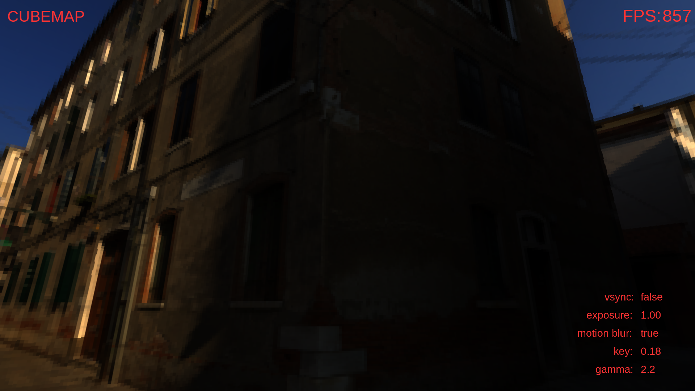

* Mid Exposure

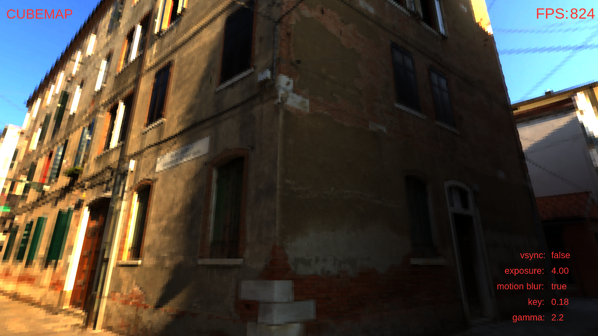

* High Exposure

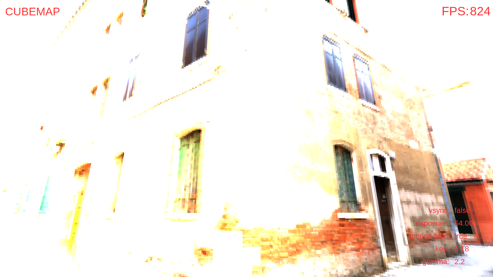

As we can observe from the results, applying linear scaling directly to HDR images does not produce visually satisfying results. In the no-exposure mode, the brightest area appears overly shiny, and the sun is not clearly visible. In contrast, with low exposure, the sun becomes more visible, but the rest of the scene turns too dark. Finally, in the high-exposure mode, linear scaling causes the entire image to become very bright, making it hard to see any details. To overcome this issue, I applied tone mapping. In Section X.X, I will explain how I implemented it.

## 2. Multi-Pass Rendering

In this part of the project, I implemented a deferred rendering pipeline to efficiently apply lighting to 3D models. Unlike forward rendering, where lighting calculations are performed during geometry rendering, deferred rendering splits the process into multiple passes. Here is the detailed explanation of how I implemented it.

### 2.1 Geometry Pass

To prepare for deferred shading, I first initialized the G-buffer by creating a custom framebuffer (gBuffer) with multiple attachments. Specifically, I allocated two floating-point textures: gPosition for storing world-space positions and gNormal for storing surface normals. Both were created using 32-bit RGBA channels (GL_RGBA32F) to preserve high precision.

In the rendering step, I used a vertex shader to compute each fragment’s world-space position and its transformed normal vector. These were then written to the corresponding G-buffer textures using multiple render targets in the fragment shader. Finally, this setup prepared everything needed to apply lighting using the saved position and normal data.

After storing the position and normal data into the G-buffer, I visualized the contents of these textures by rendering them onto a screen-space quad.

While rendering the normal map output, I encountered a visual bug and I realized the issue was due to the absence of a depth buffer in the G-buffer framebuffer. Without depth buffer, depth testing didn’t work correctly.

* World-Space Positions
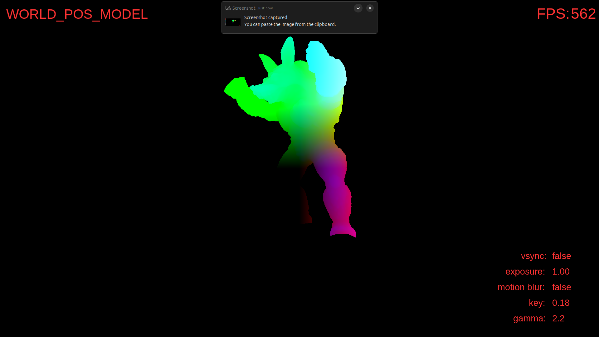

* Transformed Normal Vectors
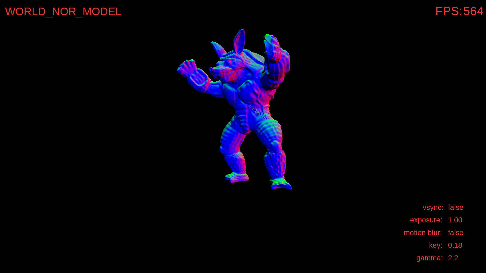

### 2.2 Deffered Lighting Pass

Once I filled the G-buffer with world-space positions and normals, I used that data to apply lighting in a deferred shading pass. In this pass, I sampled the gPosition and gNormal textures inside a lighting shader to compute ambient, diffuse, and specular components using a Phong lighting model. For the light source, I have used a point light whose position is fixed in front of the model.

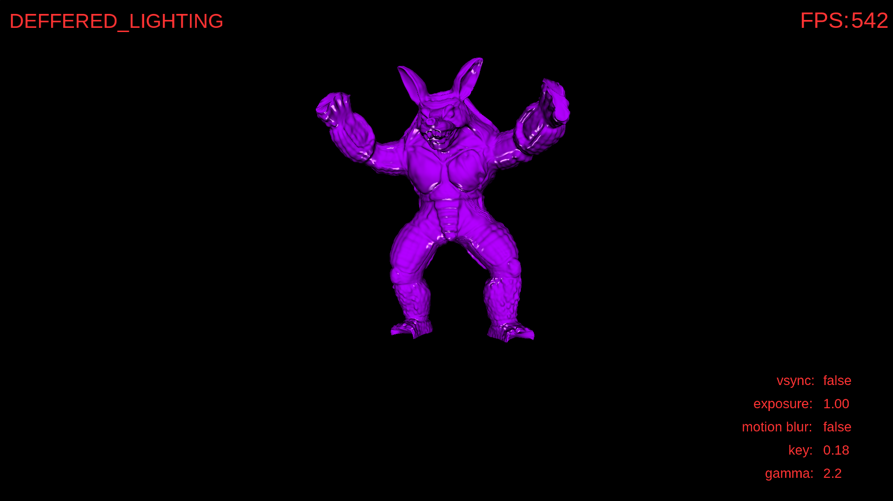

To integrate this result with the skybox, I first rendered the cubemap. Then, I used alpha blending to draw my object over the cubemap using a fullscreen quad. I used glDepthFunc(GL_LEQUAL), glDepthMask(), and glDisable(GL_CULL_FACE) to render the inside of the cubemap without writing to the depth buffer, ensuring it always appears behind the scene geometry.  The final result was written into a separate compositeTexture, which allowed me to reuse  the result in other passes like motion blur and tone mapping.

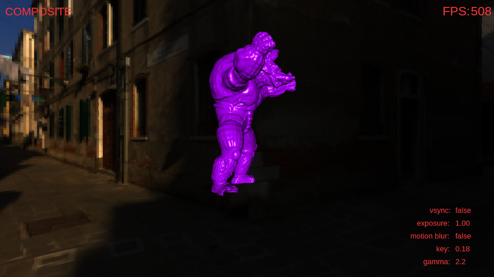

### 2.3 Motion Blur Pass

To enhance visual realism during fast camera movements, I implemented a custom motion blur effect that adapts dynamically to camera rotation speed.. If the camera rotates rapidly, the blur size increases proportionally. When the camera slows down, I gradually reduce the blur intensity over time.

In my fragment shader I performed a box filter based on the blurSize value, averaging surrounding pixels to create the blurred pixel.

### 2.4 Tonemapping Pass

In the final stage of the pipeline, I implemented tone mapping to convert the HDR lighting output into a LDR image. At first, I computed the log luminance of each pixel inside the blur shader and stored it in the alpha channel of the blurred image. This allowed me to calculate the log-average luminance of the scene efficiently using mipmapping. By calling glGenerateMipmap() on the blurred texture and reading from the 1×1 mipmap level, I get the average log luminance using textureLod().a. Then, in the tone mapping shader, I applied a Reinhard tone mapping method.

* W/O Tonemapping:

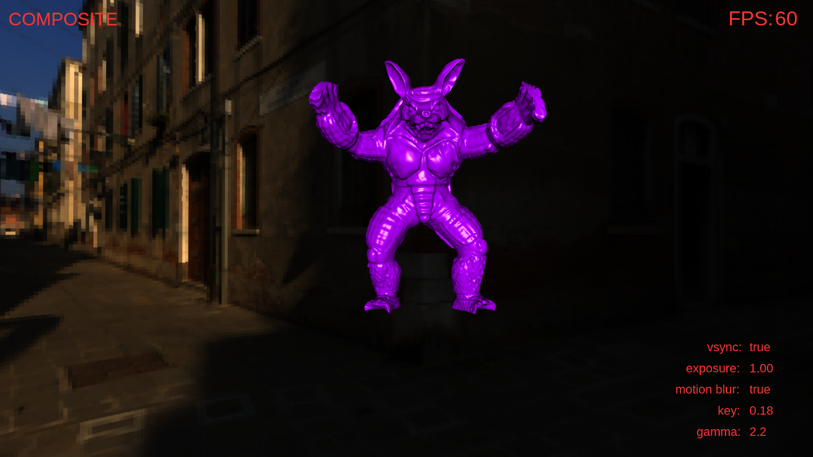

* Tonemapped w/o Gamma Correction:

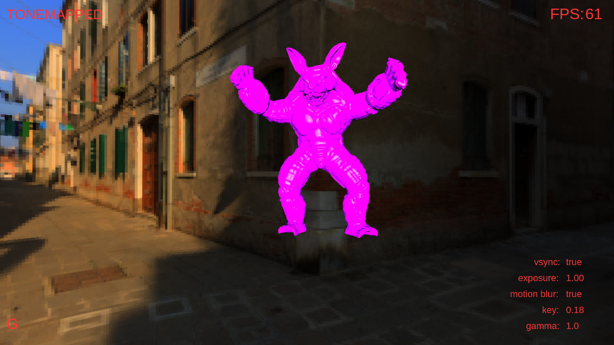

* Tonemapped with Gamma Correction:

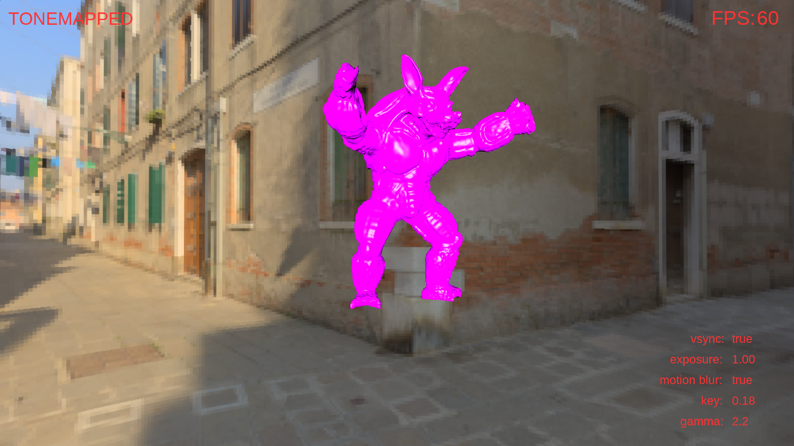

* Low Key Value:

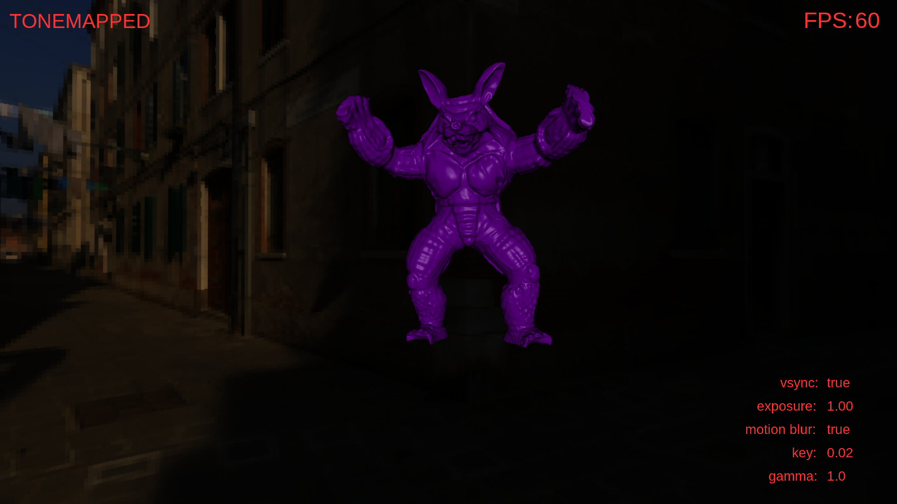

* High Key Value:

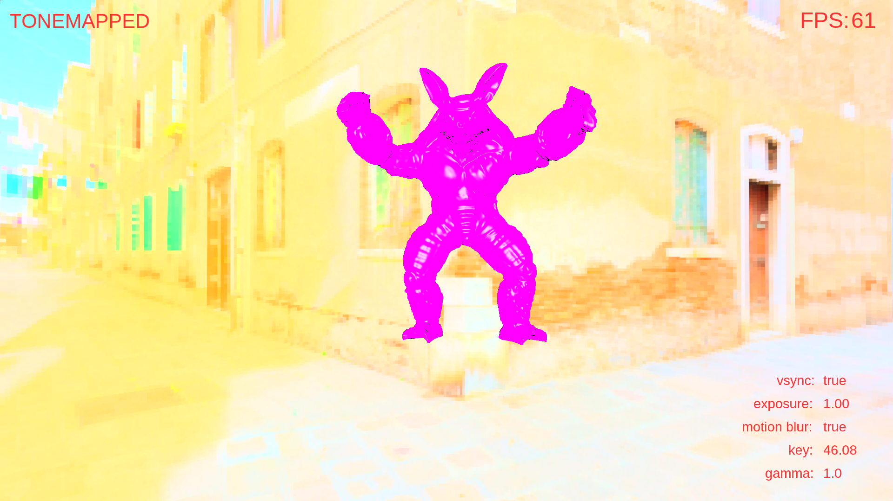

While rendering the cubemap, I noticed black space in my skybox. This was caused by insufficient precision in the cubemap texture format. Initially, I used GL_RGB16F, but switching to GL_RGB32F resolved the issue by providing higher floating-point precision.

## 3. Added Functionalities
### 3.1 Mouse Movement

To look around the environment, I implemented a mouse-driven rotation using the middle mouse button. As the user moves the mouse, horizontal movement rotates the camera left and right by creating a quaternion around the world’s Y-axis. This rotation is applied to the q_up and q_down directions. For vertival movement, moving the mouse up or down changes a value called t, which controls how much the camera looks up or down by smoothly interpolating between two directions.

3.2 Keyboard Functions

* “0” : Enable tonemapping
* “1” : Cubemap only w/o tonemapping
* “2”: World-pos object
* “3”: World-norm object
* “4”: Apply deffered lighting
* “5”: Composite result of object and cubemap
* “6”: Add motion blur
* “R”: Enable/Disable rotation
* “M”: Enable/Disable rotation
* “V”: Enable/Disable vsync
* “Space”: Enable/Disable fullscreen mode
* “G”: Enable/Disable gamma correction
* +/-: Change exposure value
* PageUp/Down: Change key value

## 4.  Final Notes

Throughout this project, I implemented a complete deferred rendering pipeline, visualized position and normal buffers, applied dynamic lighting, added custom motion blur based on camera rotation, and finished with tone mapping to make everything display-ready.

To sum up, this homework was both challenging and rewarding. I now have a great understanding of multi-pass rendering process. If you’re curious about any part of this project,  feel free to reach out.

Demo Video: [Watch directly on YouTube](https://www.youtube.com/watch?v=Px7lX-ZELiA)

Thanks for reading!


